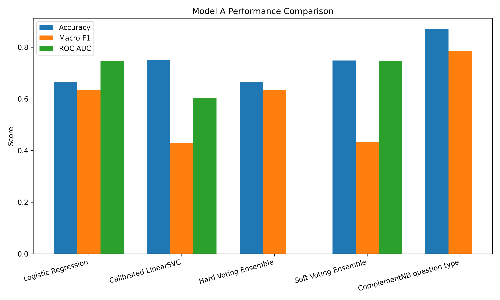
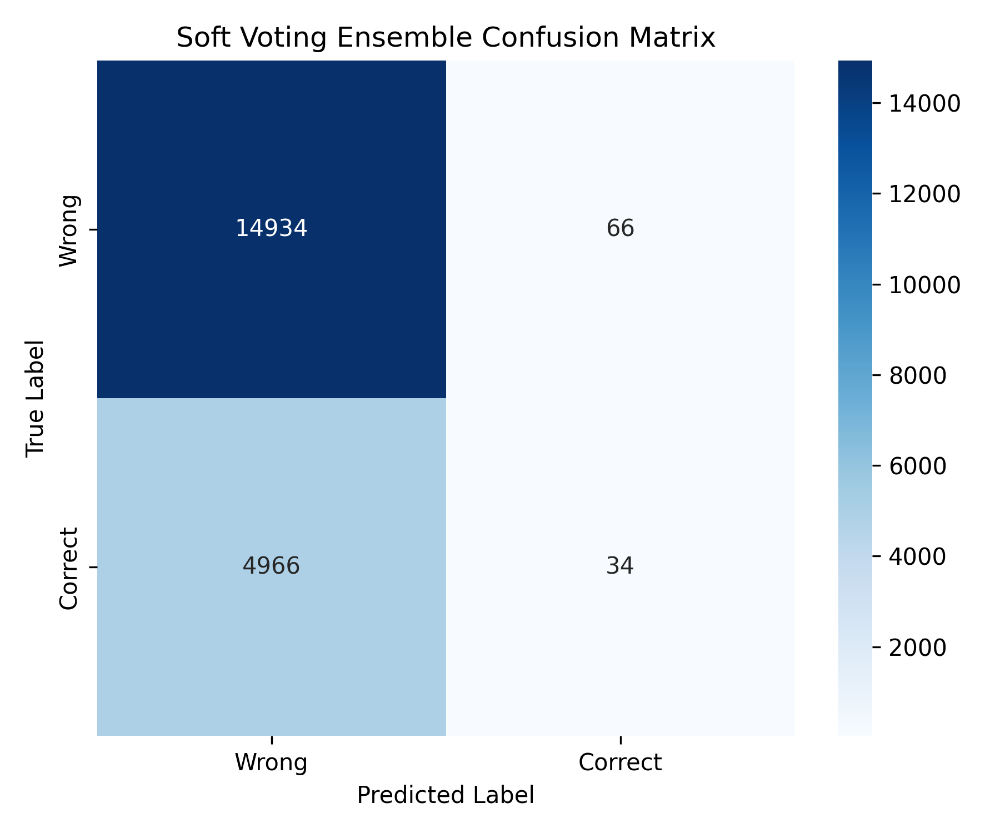
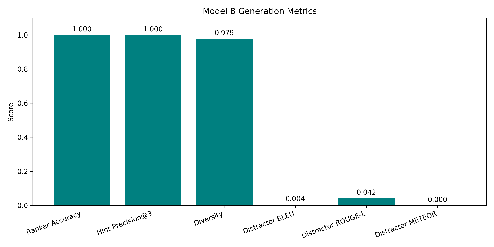

# RACE Quiz AI - Final Report Results

This document contains all the hard numbers, tables, and auto-generated charts you need to copy into the Evaluation & Discussion section of your Final Report.

## Model A: Traditional ML (Answer Verification)

### Performance Table
| model                      |   accuracy |   macro_f1 |   precision |     recall |   exact_match |   avg_positive_probability |    roc_auc |     pr_auc |   brier_score | labels                                                  |   training_wall_seconds |
|:---------------------------|-----------:|-----------:|------------:|-----------:|--------------:|---------------------------:|-----------:|-----------:|--------------:|:--------------------------------------------------------|------------------------:|
| Logistic Regression        |    0.66645 |   0.634265 |    0.644382 |   0.690833 |       0.66645 |                   0.475881 |   0.747557 |   0.417347 |      0.216224 | nan                                                     |                    16.1 |
| Calibrated LinearSVC       |    0.75    |   0.428571 |    0.375    |   0.5      |       0.75    |                   0.249986 |   0.604051 |   0.318525 |      0.187265 | nan                                                     |                    16.1 |
| Hard Voting Ensemble       |    0.66645 |   0.634265 |    0.644382 |   0.690833 |       0.66645 |                 nan        |   0        |   0        |      0        | nan                                                     |                    16.1 |
| Soft Voting Ensemble       |    0.7484  |   0.434575 |    0.545226 |   0.5012   |       0.7484  |                   0.362934 |   0.74737  |   0.417555 |      0.185558 | nan                                                     |                    16.1 |
| ComplementNB question type |    0.8691  |   0.78589  |  nan        | nan        |     nan       |                 nan        | nan        | nan        |    nan        | ['how', 'other', 'what', 'when', 'where', 'who', 'why'] |                    16.1 |

### Visualizations

### NLP Question Generation Quality
* BLEU Score: **0.0200**
* ROUGE-L Score: **0.1261**
* METEOR Score: **0.0000**

## Model A: Unsupervised & Semi-Supervised

### Unsupervised Clustering
* KMeans Silhouette Score: **0.0000**
* GMM Silhouette Score: **0.0000**
* Cluster Purity Estimate: **0.0000**

### Semi-Supervised Learning
* Label Propagation F1-Score: **0.0000**
* Traditional LR F1-Score: **0.0000**
* Pseudo-labeled rows added: **0**

## Model B: Distractor & Hint Generation

### Key Metrics
* Distractor Ranker Accuracy: **1.0000**
* Pairwise Cosine Diversity: **0.9787**
* Hint Precision@K (Top 3): **1.0000**
* Hint Scorer R2: **1.0000**

### NLP Distractor Generation Quality
* BLEU Score: **0.0045**
* ROUGE-L Score: **0.0422**
* METEOR Score: **0.0000**

### Visualizations

